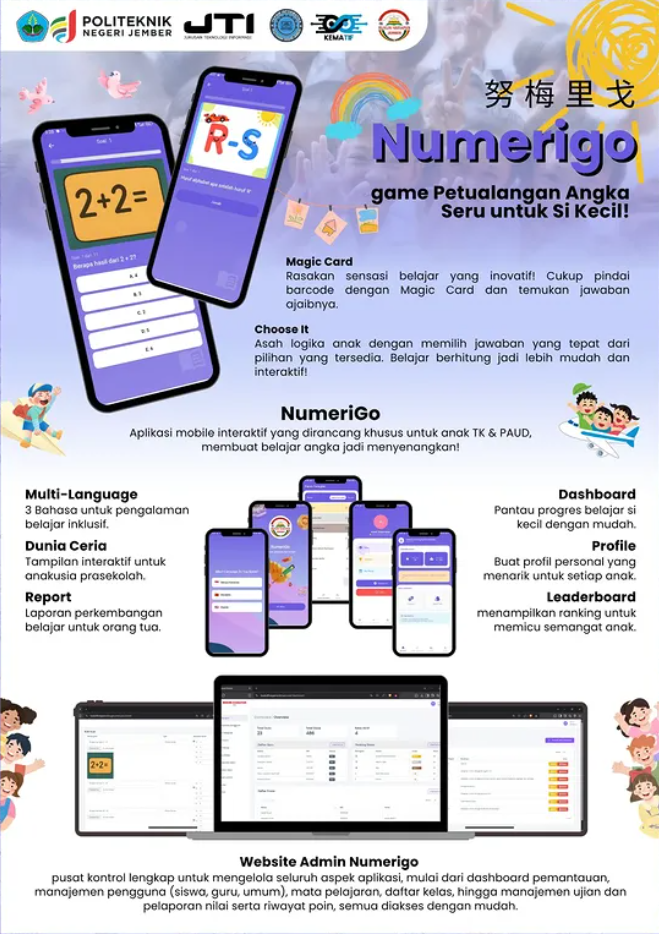

# 👥 Our Team

| Name | NIM | Instagram |
|-----|-----|-----------|
| M. Dien Vito Alivio Hidayat | E41231065 | @m.dien_vito |
| Muhammad Yusron Kurniawan | E41231326 | @y.sron_ |
| Dymas Ersa Ramadhan | E41231177 | @dymaser |
| Dema Adzhani | E41231272 | @demadzh |
| Nandita Putri Hanifa Jannah | E41231216 | @na_nditaaph |
| Abdul Muqid | E41231328 | @muqid__ |

# 🔢 Numerigo Backend API

**Numerigo Backend** adalah REST API berbasis **Laravel** yang digunakan untuk mendukung aplikasi mobile **Numerigo – Petualangan Belajar Angka untuk Si Kecil**.

Backend ini bertanggung jawab untuk mengelola data aplikasi seperti **profil anak, soal kuis, hasil permainan, laporan perkembangan belajar, serta sistem Magic Card** yang digunakan pada aplikasi mobile.

API ini dirancang agar dapat digunakan oleh aplikasi mobile secara efisien melalui komunikasi **RESTful API**.

---

# 📸 Application Preview




---

# 🚀 Features

Beberapa fitur utama dari backend Numerigo:

### 👤 Child Profile Management
Mengelola data profil anak yang menggunakan aplikasi.

Fitur yang tersedia:
- Membuat profil anak
- Mengubah data profil
- Menghapus profil
- Melihat riwayat aktivitas belajar

---

### 🎯 Quiz System (Choose It Mode)

Mengelola sistem kuis yang digunakan pada mode permainan **Choose It**.

Fitur:
- Menyediakan soal kuis angka
- Menyimpan jawaban anak
- Menghitung skor permainan

---

### 🃏 Magic Card System

Backend menyediakan data jawaban yang akan ditampilkan ketika **barcode dari kartu Magic Card dipindai**.

Proses:
1. Mobile app mengirim barcode
2. Backend memproses barcode
3. Backend mengembalikan jawaban yang sesuai

---

### 📊 Dashboard Data

Menyediakan data ringkasan aktivitas belajar anak seperti:

- jumlah permainan yang dimainkan
- total skor
- perkembangan belajar

---

### 📈 Learning Report

Menyediakan laporan perkembangan belajar anak yang dapat ditampilkan pada aplikasi mobile.

Data yang tersedia:
- riwayat kuis
- skor permainan
- statistik belajar

---

# 🛠 Tech Stack

Teknologi yang digunakan pada backend:

| Technology | Description |
|-----------|-------------|
| Laravel | Backend framework |
| PHP | Server-side language |
| MySQL | Database |
| REST API | Komunikasi dengan mobile app |
| JWT / Sanctum | Authentication API |

---

# 📂 Project Structure

Struktur folder utama project Laravel:

```
numerigo-backend
│
├── app
│   ├── Http
│   │   ├── Controllers
│   │   ├── Middleware
│   │
│   ├── Models
│   ├── Services
│
├── database
│   ├── migrations
│   ├── seeders
│
├── routes
│   ├── api.php
│
├── config
├── storage
├── public
└── README.md
```

---

# ⚙️ Installation

Langkah menjalankan project backend secara lokal.

### 1. Clone repository

```
git clone https://github.com/username/numerigo-backend.git
```

---

### 2. Masuk ke folder project

```
cd numerigo-backend
```

---

### 3. Install dependency

```
composer install
```

---

### 4. Copy file environment

```
cp .env.example .env
```

---

### 5. Generate application key

```
php artisan key:generate
```

---

### 6. Konfigurasi database

Edit file `.env`

```
DB_DATABASE=numerigo
DB_USERNAME=root
DB_PASSWORD=
```

---

### 7. Jalankan migration

```
php artisan migrate
```

---

### 8. Jalankan server

```
php artisan serve
```

Akses API di:

```
http://localhost:8000/api
```

---

# 📡 API Documentation

Contoh endpoint API yang tersedia.

### Get Quiz Questions

```
GET /api/questions
```

---

### Submit Quiz Answer

```
POST /api/quiz/submit
```

---

### Get Child Profile

```
GET /api/child/{id}
```

---

### Scan Magic Card

```
POST /api/magic-card/scan
```

Request Body:

```
{
  "barcode": "123456789"
}
```

---

### Get Learning Report

```
GET /api/report/{child_id}
```

---

# 🗄 Database Overview

Beberapa tabel utama dalam sistem:

- users
- children
- questions
- quiz_results
- magic_cards
- reports

---

# 🎯 Project Goals

Tujuan dari pengembangan backend Numerigo:

- Menyediakan API yang stabil untuk aplikasi mobile
- Mengelola data pembelajaran anak secara terstruktur
- Mendukung fitur gamifikasi dalam aplikasi edukasi
- Mengembangkan sistem edukasi berbasis teknologi

